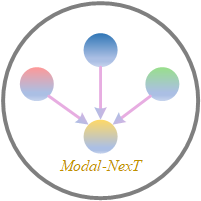
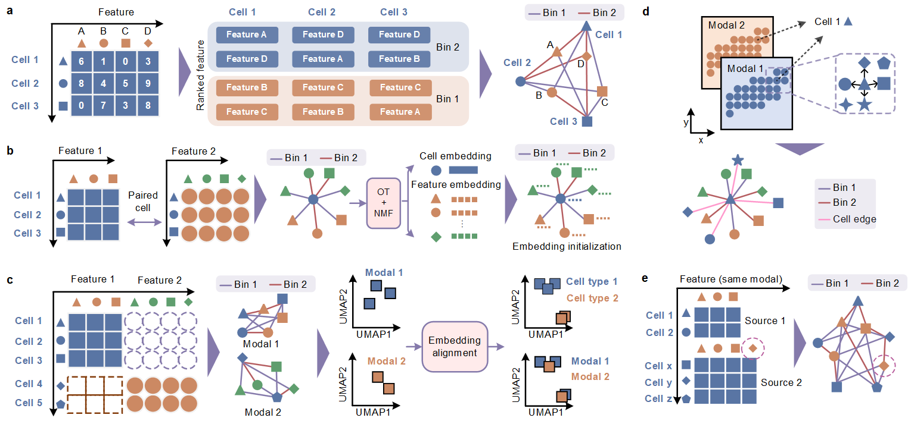

# Modal-Next  
Repository of "Modal-NexT: toward unified heterogeneous cellular data integration"

## Modal-NexT

<p align="center">
  
</p>

- Illustrations of Modal-NexT. (a): Construction of cell-feature edges, sort and bin according to the normalized feature expression to obtain different types of edges. (b): For paired multi-modal integration, cells paired across modalities are regarded as a single cell entity. Follow the process in (a) to connect feature entities in heterogeneous modalities for each cell entity. Use matrix factorization to obtain the initial embeddings of all entities. Then, update the embeddings of the entities through edge reconstruction learning. (c): For unpaired multi-modal integration, follow the process in (a) to establish a cell-feature graph for each modality, and then align the cell embeddings of heterogeneous modalities into the joint space. (d): For spatial multi-modal integration, compared with the previous processes, we will connect edges between two cells in space neighbors. (e): For multi-source integration, among the cell-feature edges, the feature entities include both the feature subsets shared by multi-source datasets and the additional features specific to each dataset.


## Dataset
We have respectively collected the corresponding datasets for benchmarking according to the summarized integration tasks. Download link: https://drive.google.com/drive/folders/1S9WOjsxDQbpTUpEVXHRpYznQghelmHDb?usp=sharing

After downloading the datasets, put the `dataset_repo` directory in the correct location.

## Installation
Python version: python 3.8

Install the following dependencies via pip or conda:
```
pip install muon
pip install torchbiggraph
pip install scanpy
pip install pytorch-ignite
pip install typing_extensions
pip install tensorboardX
pip install torch-1.11.0+cu113
```

## Tutorial
In the tutorial, we provide pipelines for paired integration, unpaired integration, and spatial integration, such as:
```
├── paired integration
    ├── paired_1_train_inmf.py
    └── paired_2_train_gnn_inmf_init.py
    └── paired_3_train_gnn_post.py
    └── paired_4_umap.ipynb
```

Execute the script according to the sequence number in the file name, such as paired integration:
```
python paired_1_train_inmf.py # step 1
python paired_2_train_gnn_inmf_init.py # step 2
python paired_3_train_gnn_post.py # step 3
```

## Reference
The code refers to the following work：
- [1] https://github.com/pinellolab/simba
- [2] https://github.com/cantinilab/mowgli/
- [3] https://github.com/JinmiaoChenLab/SpatialGlue

## Citation
Modal-NexT: toward unified heterogeneous cellular data integration. **Information Fusion**. 2025.
